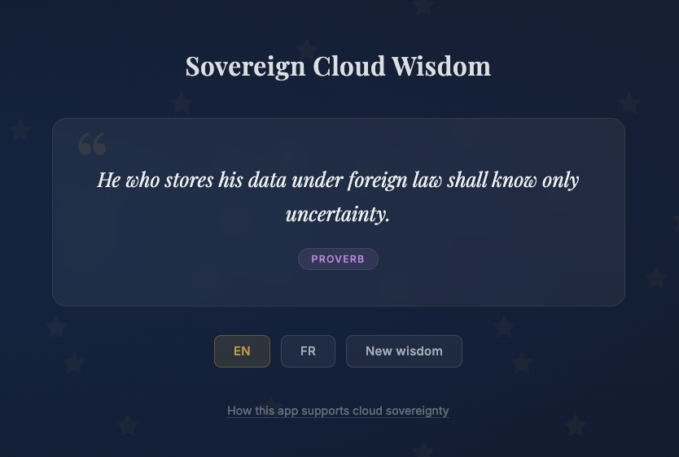

# Sovereign Cloud Wisdom

A demo application that serves wisdom about European digital sovereignty — principles, facts, quotes, and proverbs — through a web UI and a REST API.



This app is designed to run on **European sovereign cloud providers** as a companion to provider-specific infrastructure projects:
- [scaleway-starter-kit](https://github.com/lejeunen/scaleway-starter-kit) — deployed at [sovereigncloudwisdom.eu](https://sovereigncloudwisdom.eu)
- [ovh-starter-kit](https://github.com/lejeunen/ovh-starter-kit) — deployed at [ovh.sovereigncloudwisdom.eu](https://ovh.sovereigncloudwisdom.eu)

## Architecture

```
FastAPI (Python 3.12)
├── Web UI          GET /                 Jinja2 + HTMX, language auto-detection
│   ├── Wisdom      GET /ui/wisdom        Random wisdom fragment (HTMX)
│   └── Translate   GET /ui/wisdom/translate  Same wisdom, different language
├── API
│   ├── Random      GET /api/random       Random wisdom (JSON)
│   ├── List        GET /api/wisdom       List/filter wisdom (JSON)
│   ├── Get         GET /api/wisdom/:id   Get by ID (JSON)
│   ├── Create      POST /api/wisdom      Add new wisdom (JSON)
│   └── Delete      DELETE /api/wisdom/:id  Remove wisdom (JSON)
├── Health          GET /health           Kubernetes probe endpoint
└── PostgreSQL      Async (SQLAlchemy + asyncpg)
```

### Key features

- **Bilingual** — English and French, with linked translations. Language detected from `Accept-Language` header, switchable in the UI.
- **Compliance panel** — Displays the infrastructure project's compliance documentation, fetched from GitHub and rendered client-side.
- **Multi-provider** — Provider-specific configuration is isolated in env files (`.env.<provider>`) and JS files (`src/static/providers/`), making it easy to deploy on different EU cloud providers. The active provider is detected from the hostname (e.g. `ovh.sovereigncloudwisdom.eu` → OVH), with a `CLOUD_PROVIDER` env var fallback for local development.

## Prerequisites

- Docker

## Quick start

```bash
# Start PostgreSQL
docker run -d --name wisdom-db \
  -e POSTGRES_USER=app_admin \
  -e POSTGRES_PASSWORD=secret \
  -e POSTGRES_DB=app \
  -p 5432:5432 \
  postgres:16-alpine

# Build and run the app
docker build -t sovereign-cloud-wisdom .
docker run -d --name wisdom-app \
  -e DB_HOST=host.docker.internal \
  -e DB_PASSWORD=secret \
  -p 8000:8000 \
  sovereign-cloud-wisdom
```

Open http://localhost:8000

## Build and push to a cloud registry

Each cloud provider has its own env file with registry and authentication settings.

### Setup

1. Create a project/namespace in your cloud provider's container registry (e.g. `sovereign-cloud-wisdom`). The `REGISTRY` URL in the env file must match an existing project.
2. Copy and fill in the env file:

```bash
# Copy the example env file for your provider
cp .env.<provider>.example .env.<provider>

# Edit it with your credentials
vi .env.<provider>
```

### Push

```bash
# Push to Scaleway (default)
./scripts/push-image.sh

# Push to a specific provider
./scripts/push-image.sh scaleway
./scripts/push-image.sh ovh
```

The script builds the image, tags it with the current git SHA and `latest`, then pushes both tags.

### Adding a new provider

1. Create `.env.<provider>.example` with `REGISTRY`, `REGISTRY_LOGIN_CMD`, and any required credentials
2. Create `src/static/providers/<provider>.js` with the `PROVIDER` object (compliance doc URLs)
3. Run `./scripts/push-image.sh <provider>`

## API authentication

GET endpoints are public. Write endpoints (POST, DELETE) require a Bearer token passed via the `Authorization` header.

The token is read from the `API_AUTH_TOKEN` environment variable, injected from a Kubernetes secret. See the deployment section in your infra project ([scaleway-starter-kit](https://github.com/lejeunen/scaleway-starter-kit), [ovh-starter-kit](https://github.com/lejeunen/ovh-starter-kit)) for setup instructions.

### Usage

```bash
# Create a new wisdom entry
curl -X POST https://sovereigncloudwisdom.eu/api/wisdom \
  -H "Content-Type: application/json" \
  -H "Authorization: Bearer $TOKEN" \
  -d '{"text": "Data sovereignty starts with infrastructure choices.", "category": "principle"}'
```

### Local development

```bash
docker run -d --name wisdom-app \
  -e DB_HOST=host.docker.internal \
  -e DB_PASSWORD=secret \
  -e API_AUTH_TOKEN=my-dev-token \
  -p 8000:8000 \
  sovereign-cloud-wisdom
```

## Analytics

Server-side Matomo tracking is supported via optional env vars `MATOMO_URL` and `MATOMO_SITE_ID`. See [sovereign-analytics](https://github.com/lejeunen/sovereign-analytics) for the Matomo setup.

## Project structure

```
├── Dockerfile                  Multi-stage production build
├── requirements.txt            Python dependencies
├── .env.scaleway.example       Scaleway registry config template
├── .env.ovh.example            OVH registry config template
├── scripts/
│   └── push-image.sh           Build, tag, and push to a cloud registry
└── src/
    ├── main.py                 FastAPI app, routes, and endpoints
    ├── models.py               SQLAlchemy models and Pydantic schemas
    ├── database.py             Async PostgreSQL connection
    ├── seed.py                 Bilingual seed data (32 EN + 32 FR)
    ├── tracking.py             Server-side Matomo analytics
    ├── static/
    │   └── providers/
    │       ├── scaleway.js     Scaleway-specific config
    │       └── ovh.js          OVHcloud-specific config
    └── templates/
        ├── index.html          Main page (Jinja2 + HTMX)
        └── fragments/
            └── wisdom.html     Wisdom card fragment (HTMX swap target)
```
